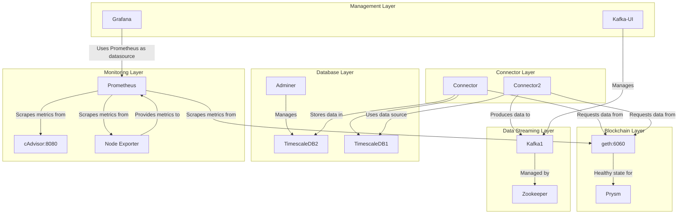

# blockblock

## Architecture Diagram

```mermaid
graph TD;
    J[Adminer] -->|Manages| G[TimescaleDB2];
    H[Connector] -->|Stores data in| G[TimescaleDB2];
    H --> F[TimescaleDB1];
    I[Connector2] -->|Uses data source| F[TimescaleDB1];
    A[geth] -->|Healthy state for| B[Prysm];
    C[Kafka1] -->|Managed by| D[Zookeeper];
    H[Connector] -->|Requests data from| A[geth];
    I[Connector2] -->|Produces data to| C[Kafka1];
    I[Connector2] -->|Requests data from| A[geth];
    K[Kafka-UI] -->|Manages| C[Kafka1];
    L[Prometheus] -->|Scrapes metrics from| A[geth:6060];
    L[Prometheus] -->|Scrapes metrics from| M[cAdvisor:8080];
    L[Prometheus] -->|Scrapes metrics from| N[Node Exporter:9100];
    N[Node Exporter] -->|Provides metrics to| L[Prometheus];
    O[Grafana] -->|Uses Prometheus as datasource| L[Prometheus];

    subgraph Blockchain Layer
      A
      B
    end

    subgraph Data Streaming Layer
      C
      D
    end

    subgraph Database Layer
      F
      G
      J
    end

    subgraph Connector Layer
      H
      I
    end

    subgraph Monitoring Layer
      L
      M
      N
    end

    subgraph Management Layer
      K
      O
    end
```