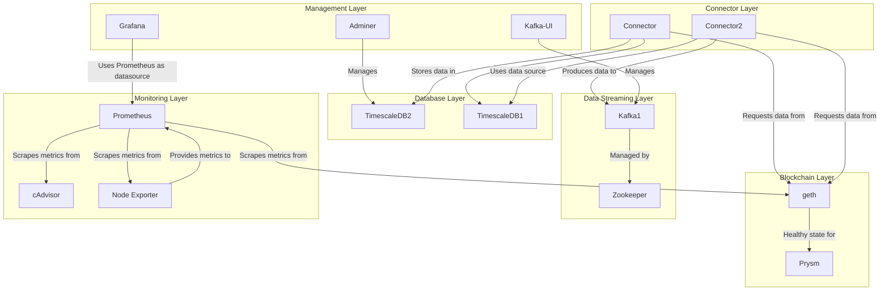
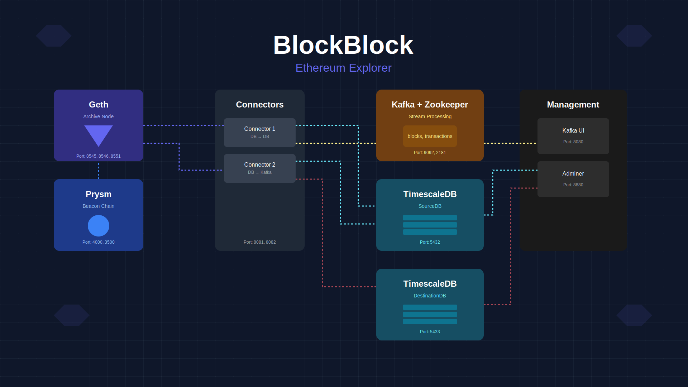

# BlockBlock Monorepo

This repository contains all components for the BlockBlock blockchain analytics platform, including backend services, frontend app, infrastructure, and monitoring.

## Projects

- **app/** — Next.js web application for exploring blockchain data.
- **django/** — Django REST API for blockchain analytics and management.
- **python/** — Python service for streaming Ethereum block headers from Geth to Kafka.
- **geth/** — Sample configuration for running a Geth Ethereum node.
- **nginx/** — Nginx configuration for frontend/backend proxying with SSL support.
- **prometheus/** — Prometheus configuration and rules for monitoring Geth, Docker, and system metrics.
- **grafana/** — Grafana dashboards and data source configuration for visualizing metrics.

## Quick Start

1. **Clone the repository:**
  ```bash
  git clone https://github.com/your-org/blockblock.git
  cd blockblock
  ```

2. **See individual project directories for setup instructions:**
  - [app/README.md](./app/README.md)
  - [django/README.md](./django/README.md)
  - [python/README.md](./python/README.md)
  - [geth/README.md](./geth/README.md)
  - [nginx/README.md](./nginx/README.md)
  - [prometheus/README.md](./prometheus/README.md)
  - [grafana/README.md](./grafana/README.md)

## Hardware Requirements

Running Ethereum nodes (Geth and Prysm) requires significant hardware resources:

### Geth (Ethereum Execution Node)
- **CPU:** Quad-core (4 cores) or higher
- **RAM:** Minimum 16 GB (32 GB+ recommended for archive node)
- **Storage:** SSD, at least 2 TB (NVMe recommended for archive node)
- **Bandwidth:** Minimum 25 Mbps (higher is better for fast sync and peer connectivity)

### Prysm (Ethereum Consensus Node)
- **CPU:** Dual-core (2 cores) or higher
- **RAM:** Minimum 8 GB (16 GB+ recommended)
- **Storage:** SSD, at least 200 GB
- **Bandwidth:** Minimum 10 Mbps (stable connection required)

> **Note:** Running both nodes on the same machine requires combining the above specs. For production or archival use, higher specs and reliable internet are strongly recommended.

## Architecture

BlockBlock is designed as a modular, containerized platform:

- **Frontend:** Next.js app for real-time blockchain exploration.
- **Backend:** Django REST API and Python streaming service.
- **Node:** Geth Ethereum node with custom configuration.
- **Infrastructure:** Nginx for proxying, Prometheus & Grafana for monitoring.

### Architecture Diagram



### System Overview

The platform is orchestrated using Docker Compose. All major services—including Geth, Prysm, Kafka, TimescaleDB, Django backend, Next.js frontend, connectors, monitoring, and management UIs—are defined in [`docker-compose.yml`](./docker-compose.yml). This file provides a reproducible environment for local development and deployment.

A visual overview of the architecture is available in [`architecture.svg`](./architecture.svg):



- **Ethereum Nodes:** Geth (archive node) and Prysm (beacon chain) provide blockchain data.
- **Data Pipeline:** Kafka and Zookeeper handle streaming; TimescaleDB stores source and destination data.
- **Connectors:** Services move data between databases and Kafka.
- **Management:** Kafka UI and Adminer for monitoring and database management.
- **Monitoring:** Prometheus, Grafana, cAdvisor, and node-exporter for metrics and dashboards.
- **Frontend/Backend:** Next.js and Django provide user-facing and API services.
- **Proxy:** Nginx routes traffic to frontend and backend.

## License

See individual directories for license details.

---

BlockBlock is ideal for developers and blockchain enthusiasts seeking a complete, extensible platform for blockchain data analytics and monitoring.